    

## Hey, I'm SwankyMan!
 
I'm a programmer who makes games, game engines, and pretty much anything related to games. Well, I like building other things like AIs and stuff like that, but in general, I build pretty much anything. I like building things from the ground up and make them as easy to use and implement new ideas into them.
 
I got my start on Khan Academy 3 years ago, which is where I learned JavaScript, HTML and CSS. A great computer programming community! I really recommend! I made a lot of programs there and kept pushing to see how far I could take it. But as time grew, I yearned for more, so about present time, I moved onto larger tasks and projects. Eventually that turned into building my own 3D engine here in GitHub and a lot of other things like porting games from Godot directly into the sandboxed website Khan Academy as I was talking a second ago, and I've been building bigger stuff ever since. My Khan Academy profile link is **[here](http://www.khanacademy.org/profile/IAmChaos)**.
 
### What I do
 
- **Engine programming:** I write rendering code with WebGPU and care a lot about performance. I like keeping things data-oriented, lean and fast without making them hard to use.
- **Game development:** I build games in Godot and on my own engine, and sometimes in Khan Academy. I like working on gameplay systems, worlds you can walk around in, and making everything feel good to play.
- **Web:** HTML, CSS and JavaScript are where I started, and I still use them for tools, demos and anything that runs in a browser.
### What I'm working on
 
- **[Axion](https://github.com/SwankyMan88/Axion):** my own WebGPU 3D engine. It's data-oriented and render-only like three.js, so you handle input and controls your way. It's built for power, performance and ease of use, and it loads from a single script tag.
- **Something new:** a bigger game I'm building on Axion, demo is Pine Valley on KA **[here](https://www.khanacademy.org/computer-programming/pine-valley/6354310186516480)**. More on that later 👀

### How I work
 
I care about performance and clean code that's still easy to read. I'd rather build something myself and know it inside out than stack up a bunch of libraries. I test everything hands-on and keep iterating until it feels right.
 
### Notable Projects I've Built
 

    

 
